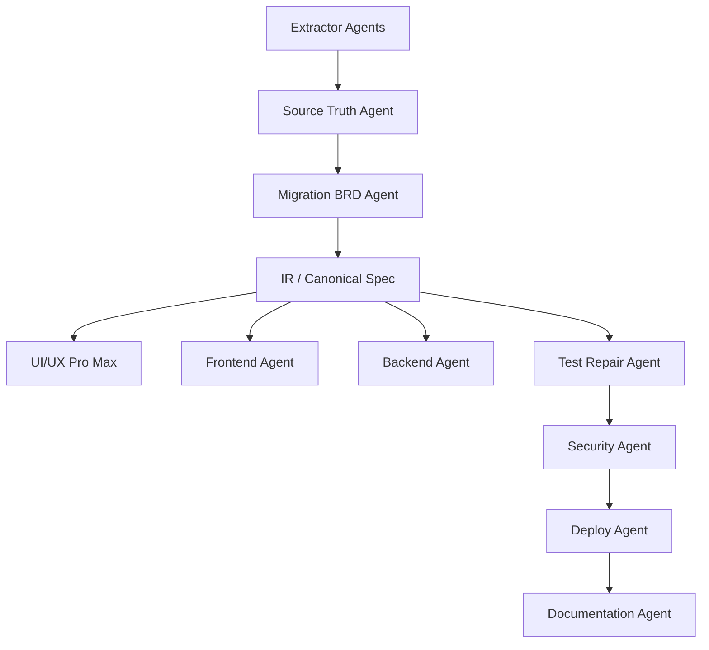

# NoCode2ProCode by TrustEngines User Manual

NoCode2ProCode is a migration framework for turning no-code, low-code, website, screenshot, document, API, and data inputs into a structured pro-code migration workspace.

The framework does **not** jump straight from input to code. It follows a controlled pipeline:

```text
extract -> understand -> plan migration -> canonical spec -> generate -> repair -> QA -> replay -> deploy
```

## 1. Where to put inputs

First install Genesis from the copied project folder:

```powershell
cd "C:\Users\Vishwas\Desktop\AI\1.Python Work Space\NoCode2ProCode-Genesis"
powershell -NoProfile -ExecutionPolicy Bypass -File .\install-genesis.ps1
```

Inside Claude Code, the user-friendly instruction is:

```text
install Genesis E2E
```

That instruction is mapped by `CLAUDE.md` and `.claude/commands/install-genesis-e2e.md` to the full local installer command:

```powershell
powershell -NoProfile -ExecutionPolicy Bypass -File .\install-genesis.ps1 -Profile FullLocal -AllowSystemInstall -IncludeSecurityTools
```

That one command installs the local Python framework, local E2E libraries, Playwright/Chromium, visual QA packages, motion/UI tooling, API tooling, and Genesis Claude command/skill files. It writes install status to `.genesis_runtime/install_report.md`.

At the end of installation, Genesis opens this Full User Manual HTML automatically so the user can continue with onboarding, commands, pipeline understanding, and the first migration run.

Put your migration sources here:

[`C:\Users\Vishwas\Desktop\AI\1.Python Work Space\NoCode2ProCode-Genesis\migration_inputs`](</C:/Users/Vishwas/Desktop/AI/1.Python Work Space/NoCode2ProCode-Genesis/migration_inputs>)

Recommended flexible input layout:

```text
migration_inputs/
  migration_request.yaml
  raw_data/
  images/
  videos/
```

Use this simple rule:

- `raw_data/` is for anything source/business related: exports, BRDs, APIs, DB files, CSV/Excel, XML/JSON/YAML, website notes, PowerApps packages.
- `images/` is for visual reference: screenshots, mockups, brand references, component references, dashboard/table/form examples.
- `videos/` is for runtime behavior: walkthroughs, click flows, happy paths, screen recordings, defect recordings.

Genesis still supports older flat input folders. The three-folder model is just the cleaner standard because it tells the agents what each file is meant to influence.

Typical inputs:

- Power Platform solution `.zip`
- `.msapp`
- `Src/*.pa.yaml`
- XML / JSON / YAML exports
- SQL / CSV / Excel
- screenshots
- video walkthroughs
- BRD / DOCX / PDF / PPTX
- website references
- OpenAPI files

Recommended companion file:

- [`migration_request.example.yaml`](</C:/Users/Vishwas/Desktop/AI/1.Python Work Space/NoCode2ProCode-Genesis/migration_inputs/migration_request.example.yaml>)

Copy it to `migration_request.yaml` and fill in your app name, domain, goal, target stack, and notes.

Optional manifests can clarify file purpose:

```text
images/image_manifest.yaml
videos/video_manifest.yaml
raw_data/raw_data_manifest.yaml
```

Example image entry:

```yaml
images:
  - file: dashboard.png
    screen: Dashboard
    purpose: exact_ui_reference
    priority: high
    notes: "Use this layout closely."
```

These manifest files are not required. If missing, Genesis infers the purpose from folder and filename.

## 2. Main idea

The framework already has a single migration pipeline surface:

- [`/genesis-migrate`](</C:/Users/Vishwas/Desktop/AI/1.Python Work Space/NoCode2ProCode-Genesis/.claude/commands/genesis-migrate.md>)
- [`/nocode2procode-migrate`](</C:/Users/Vishwas/Desktop/AI/1.Python Work Space/NoCode2ProCode-Genesis/.claude/commands/nocode2procode-migrate.md>)

That single migrate entrypoint is the top-level orchestration command. Under the hood, the pipeline is defined in:

- [`genesis.flow.yaml`](</C:/Users/Vishwas/Desktop/AI/1.Python Work Space/NoCode2ProCode-Genesis/.genesis/genesis.flow.yaml>)

## 3. How the framework works

```mermaid
flowchart LR
    A["migration_inputs/"] --> B["Validate Inputs + Start Session"]
    B --> C["BRD Extraction + Mockup Inventory"]
    C --> D["BRD Understanding Gate"]
    D --> E["Delivery + Stack Decision"]
    E --> F["Migration Output Mode Gate"]
    F --> G["Discover Sources + Build Swarm Plan"]
    G --> H["Extract Native AST"]
    H --> I["Record Runtime Evidence + Browser Plan"]
    I --> J["Resolve Source Truth"]
    J --> K["Source Truth Gate"]
    K --> L["Build ULC-IR + Canonical Spec"]
    L --> M["Canonical Spec Gate"]
    M --> N["Design Strategy + Visual Contract"]
    N --> O["Design System Gate"]
    O --> P["Generate App Scaffold"]
    P --> Q["Generated App Gate"]
    Q --> R["Agent Repair Loop"]
    R --> S["QA + Visual QA"]
    S --> T["QA Result Gate"]
    T --> U["Replay Dashboard"]
    U --> V["Final Release Gate"]
    V --> W["Verified Memory + Patterns"]
```



### BRD understanding gate

Immediately after BRD/design/mockup extraction, Genesis writes a reviewable BRD understanding pack:

- `brd_understanding_summary.md`
- `brd_understanding_report.json`
- `brd_understanding_gate.json`
- `brd_edit_request.json`
- `brd_semantic_patch_report.json`
- `approved_brd_plan.json`

This gate shows what Genesis understood from the raw input: app goal, pages, roles, logic, workflows, entities, acceptance criteria, images/mockups, privacy/security notes, missing questions, and confidence.

Gate options:

- `A` approve the extracted BRD understanding
- `B` approve with assumptions
- `C` add missing requirements or evidence
- `D` edit the BRD before generation

Example:

```yaml
brd_gate_decision: D
brd_edit_notes: "Add admin approval queue, remove billing page, and keep only patient-facing workflows."
```

When edit notes are supplied, Genesis converts them into a semantic patch. Clear add/remove/update instructions are applied directly into `approved_brd_plan.json`; unclear instructions stay visible in `brd_semantic_patch_report.json` as manual-review items for later agents.

### Migration output mode gate

Before planning and generation continue, Genesis records a mode decision in `migration_mode_decision.json`.

Use one of these in `migration_request.yaml`:

- `migration_output_mode: production_e2e_app`  
  Full production-style frontend, backend, database, API, tests, security, docs, deployment artifacts, replay dashboard, and readiness scorecard.

- `migration_output_mode: local_demo_app`  
  Fast localhost demo with sample data, demo login, `run_demo.ps1`, `demo_report.md`, and `production_gap_report.md`.

- `migration_output_mode: hybrid_pilot_app`  
  Recommended default for company demos: polished localhost pilot plus production-shaped frontend/backend/database/test structure.

If this field is missing, Genesis defaults to Hybrid Pilot and marks human confirmation as recommended.

### Generated app approval gate

After `generate_code`, Genesis shows the generated frontend/backend/database/tests/docs summary before the repair and QA stages. This gate does not ask the user to choose the next pipeline stage. The sequence always continues to `run_agent_repair_loop`.

Options:

- `A` approve generated output
- `B` reject generated output and explain what is wrong
- `C` add extra input or a missing requirement

Examples:

```yaml
generated_app_gate_decision: A
```

```yaml
generated_app_gate_decision: B
generated_app_review_notes: "Generated dashboard is missing the admin approval queue."
```

```yaml
generated_app_gate_decision: C
generated_app_review_notes: "Add role-based admin view before QA."
```

Outputs:

- `generated_app_review_summary.md`
- `generated_app_review_report.json`
- `generated_app_approval_gate.json`
- `generated_app_human_notes.json`
- `generated_app_patch_instructions.json`
- `generated_app_semantic_patch_report.json`

If the user rejects or adds input, Genesis parses that note into structured semantic actions and writes `docs/HUMAN_PATCH_REQUESTS.md` during the repair-loop stage for downstream repair/build agents.

### Human approval gates

Genesis gates are approval checkpoints only. They do **not** skip, reorder, or replace the pipeline. Each gate writes structured JSON, updates `human_gate_context.json`, and downstream agents read that file before planning, generating, repairing, testing, or approving.

| Gate | Options | Main output |
|---|---|---|
| BRD Understanding Gate | `A` approve, `B` approve with assumptions, `C` add evidence, `D` edit BRD | `approved_brd_plan.json` |
| Migration Mode Gate | `A` production E2E, `B` local demo, `C` hybrid pilot | `migration_mode_decision.json` |
| Source Truth Gate | `A` approve, `B` correct assumption, `C` add evidence, `D` reject decision | `approved_source_truth_report.json` |
| Canonical Spec Gate | `A` approve spec, `B` add scope, `C` remove scope, `D` edit spec | `approved_canonical_app_spec.json` |
| Design System Gate | `A` approve design, `B` change style, `C` add UX requirement, `D` reject design | `approved_design_system_plan.json` |
| Generated App Gate | `A` approve, `B` reject with issue, `C` add missing feature | `generated_app_patch_instructions.json` |
| QA Result Gate | `A` approve QA, `B` reject quality, `C` add test requirement, `D` request repair | `qa_result_repair_instructions.json` |
| Final Release Gate | `A` approve delivery, `B` approve demo only, `C` reject final output, `D` add handoff notes | `final_release_approval_gate.json` |

The behavior is consistent:

```text
user choice + optional notes
-> gate JSON artifact
-> human_gate_context.json
-> next configured pipeline stage
-> downstream agents use the notes as scoped context
```

## 4. What happens after extraction

After NoCode2ProCode extracts data from your input files, it does this next:

1. Normalize extracted artifacts into:
   - `platform_ast.json`
   - `website_ast.json`
   - `api_ast.json`
   - `db_ast.json`
   - `runtime_evidence.json`
   - `document_intent.json`
2. Show the BRD Understanding Gate:
   - `brd_understanding_summary.md`
   - `brd_understanding_report.json`
   - `brd_understanding_gate.json`
   - `brd_edit_request.json`
   - `brd_semantic_patch_report.json`
   - `approved_brd_plan.json`
3. Build `source_baseline.json`
4. Resolve source truth
5. Show the Source Truth Gate and freeze `approved_source_truth_report.json`
6. Build migration intent and planning artifacts
7. Build ULC-IR
8. Build `canonical_app_spec.json`
9. Show the Canonical Spec Gate and freeze `approved_canonical_app_spec.json`
10. Build design strategy and design system artifacts
11. Show the Design System Gate and freeze `approved_design_system_plan.json`
12. Generate the migration workspace
13. Show the Generated App Approval Gate
14. Run repair, QA, visual QA, and design quality scoring
15. Show the QA Result Gate
16. Build replay, final release approval, and verified learning outputs

So extraction is the **front half** of the migration pipeline, not the end state.

## 5. Current CLI commands

Run these from the project root:

```powershell
cd "C:\Users\Vishwas\Desktop\AI\1.Python Work Space\NoCode2ProCode-Genesis"
.\.venv\Scripts\Activate.ps1
```

Below is the full high-level CLI command list.

### Validation and framework inspection

- `nocode2procode install`  
  Run the one-command Genesis installer from the CLI after the package is already present.

- `nocode2procode validate`  
  Validate the framework YAML/config files and make sure the pipeline definition is consistent.

- `nocode2procode plan`  
  Show the ordered pipeline stages for the selected migration entrypoint.

- `nocode2procode install-plan`  
  Show tool installation expectations, install modes, and command hints from the framework config.

- `nocode2procode check-tool <stage> <tool>`  
  Check whether a specific tool is allowed in a specific pipeline stage.

- `nocode2procode route <signal>`  
  Show how a routing signal like `website_url_present` or `powerapps_export_present` is mapped to tools, stages, and prompts.

### Workspace and helper commands

- `nocode2procode init-workspace "App Name"`  
  Create a migration workspace and prepare the default input folder.

- `nocode2procode estimate "App Name"`  
  Create a simple dry-run estimate report placeholder for a migration.

- `nocode2procode visual-lock <screen_id>`  
  Create a starter `visual_lock_spec.json` for a screen or page.

- `nocode2procode design-strategy`  
  Create a design strategy bundle including Magic selection, UI/UX direction, and motion plan.

- `nocode2procode design-quality`  
  Create a starter design quality report and approval summary.

- `nocode2procode stack-resolve "<prompt>"`  
  Resolve delivery mode and target stack from the migration goal and domain hints.

### Main pipeline commands

- `nocode2procode discover`  
  Run intake, discovery, extraction, and runtime-evidence planning from the input folder.

- `nocode2procode plan-run`  
  Run the planning path through source truth, IR validation, canonical spec creation, and visual-contract setup.

- `nocode2procode generate`  
  Run the pipeline through deterministic scaffold generation.

- `nocode2procode qa`  
  Run the pipeline through scaffold QA, visual QA placeholders, and design-quality reporting.

- `nocode2procode replay`  
  Build the replay dashboard and traceability outputs for the current migration workspace.

- `nocode2procode migrate`  
  Run the full end-to-end migration pipeline from intake through replay, approval, and verified-learning artifacts.

- `nocode2procode genesis-migrate`  
  Compatibility alias for `nocode2procode migrate`.

### Session and runtime commands

- `nocode2procode sessions`  
  List known migration runtime sessions and their current status.

- `nocode2procode status "C:\path\to\workspace"`  
  Show the current runtime session, last completed stage, and approval state for a workspace.

### Most important command

```powershell
nocode2procode migrate
```

That command reads from `migration_inputs/`, creates or reuses a migration workspace, and runs the pipeline through discovery, planning, canonical spec creation, scaffold generation, replay, and learning outputs.

It now also performs:

- a deterministic preflight repair pass for missing or malformed scaffold files
- local code-quality checks on generated artifacts
- generated backend smoke validation when FastAPI is available
- local secret-pattern scanning
- production readiness scoring

Useful examples:

```powershell
nocode2procode migrate --app-name "Customer Portal"
nocode2procode migrate --input-dir "C:\path\to\custom_inputs"
nocode2procode migrate --workspace "C:\path\to\existing_workspace"
nocode2procode status "C:\path\to\existing_workspace"
```

## 6. Claude command prompts

Use these inside Claude Code:

- [`/nocode2procode-estimate`](</C:/Users/Vishwas/Desktop/AI/1.Python Work Space/NoCode2ProCode-Genesis/.claude/commands/nocode2procode-estimate.md>)
  - Dry run, effort, cost, unsupported items
- [`/nocode2procode-discover`](</C:/Users/Vishwas/Desktop/AI/1.Python Work Space/NoCode2ProCode-Genesis/.claude/commands/nocode2procode-discover.md>)
  - Input discovery, source inventory, runtime evidence setup
- [`/nocode2procode-plan`](</C:/Users/Vishwas/Desktop/AI/1.Python Work Space/NoCode2ProCode-Genesis/.claude/commands/nocode2procode-plan.md>)
  - Source truth, migration planning, canonical spec
- [`/nocode2procode-generate`](</C:/Users/Vishwas/Desktop/AI/1.Python Work Space/NoCode2ProCode-Genesis/.claude/commands/nocode2procode-generate.md>)
  - Deterministic scaffold generation
- [`/nocode2procode-qa`](</C:/Users/Vishwas/Desktop/AI/1.Python Work Space/NoCode2ProCode-Genesis/.claude/commands/nocode2procode-qa.md>)
  - QA, security, accessibility, visual checks
- [`/nocode2procode-replay`](</C:/Users/Vishwas/Desktop/AI/1.Python Work Space/NoCode2ProCode-Genesis/.claude/commands/nocode2procode-replay.md>)
  - Replay dashboard and traceability
- [`/nocode2procode-migrate`](</C:/Users/Vishwas/Desktop/AI/1.Python Work Space/NoCode2ProCode-Genesis/.claude/commands/nocode2procode-migrate.md>)
  - Full end-to-end pipeline

Source-specific commands:

- [`/nocode2procode-image`](</C:/Users/Vishwas/Desktop/AI/1.Python Work Space/NoCode2ProCode-Genesis/.claude/commands/nocode2procode-image.md>)
- [`/nocode2procode-figma`](</C:/Users/Vishwas/Desktop/AI/1.Python Work Space/NoCode2ProCode-Genesis/.claude/commands/nocode2procode-figma.md>)
- [`/nocode2procode-website`](</C:/Users/Vishwas/Desktop/AI/1.Python Work Space/NoCode2ProCode-Genesis/.claude/commands/nocode2procode-website.md>)

## 7. Agent model

The framework now has two major agent groups.

**Extractor and planning agents**

- `solution_intake_agent`
- `powerapps_extractor_agent`
- `website_extractor_agent`
- `document_extractor_agent`
- `runtime_evidence_agent`
- `swarm_coordinator_agent`
- `source_truth_agent`
- `migration_brd_agent`
- `memory_curator_agent`

These live in:

- [`genesis.agents.yaml`](</C:/Users/Vishwas/Desktop/AI/1.Python Work Space/NoCode2ProCode-Genesis/.genesis/genesis.agents.yaml>)

**Build and delivery agents**

- `ui_ux_pro_max`
- `frontend_agent`
- `backend_agent`
- `test_repair_agent`
- `security_agent`
- `deploy_agent`
- `documentation_agent`

The execution idea is:



## 8. What the runtime now creates

When you run `nocode2procode migrate`, the workspace includes:

- `input_intake_manifest.json`
- `runtime_session.json`
- `session_events.jsonl`
- `provider_routing_plan.json`
- `memory_retrieval_plan.json`
- `memory_context.json`
- `source_baseline.json`
- `agent_execution_plan.json`
- `swarm_topology.json`
- `platform_ast.json`
- `design_ast.json`
- `website_ast.json`
- `api_ast.json`
- `db_ast.json`
- `document_intent.json`
- `browser_runtime_plan.json`
- `runtime_capture_contract.json`
- `runtime_evidence.json`
- `source_truth_report.json`
- `source_conflict_report.json`
- `canonical_app_spec.json`
- `checkpoint_manifest.json`
- `generated_file_manifest.json`
- `genesis_replay_dashboard.html`
- `verified_memory_packet.json`
- `migration_learning_report.json`
- `repair_loop_report.json`
- `code_quality_report.json`
- `test_report.json`
- `security_review.json`
- `production_readiness_scorecard.json`

Generated workspaces go under:

- [`genesis_apps/`](</C:/Users/Vishwas/Desktop/AI/1.Python Work Space/NoCode2ProCode-Genesis/genesis_apps>)

## 9. What is implemented now vs later

What is now wired:

- migration input folder convention
- intake classification
- durable runtime session tracking
- provider/model routing planning
- verified-memory retrieval and writeback
- swarm-style agent execution planning
- browser/runtime capture planning
- best-effort Power Apps archive inspection
- generic XML / JSON / YAML / SQL / CSV intake
- migration orchestration from a single `migrate` command
- stage checkpoints
- planning artifacts
- canonical spec generation
- scaffold generation
- deterministic scaffold normalization before QA
- local quality-gate execution for generated artifacts
- backend health smoke testing when runtime dependencies are available
- production readiness scorecard generation
- richer BRD requirement extraction
- BRD Understanding Gate with approve/edit/more-evidence choices
- `approved_brd_plan.json` feeding downstream IR and canonical spec generation
- Generated App Approval Gate with approve/reject/add-input notes feeding the repair loop
- semantic patch reports for BRD edits and generated-app feedback
- Office document text extraction for `.docx` and `.pptx`
- screenshot viewport and UI-hint extraction
- local/file runtime HTML capture for safer browser evidence
- replay dashboard generation

What still needs deeper future implementation:

- live Playwright runtime capture
- Firecrawl integration
- full Power Fx parsing
- remote authenticated website crawling by default
- real compiler/build execution
- true agent repair runtime
- production deployment automation
- pixel-accurate visual QA
- stronger prior-memory matching with embeddings/vector search

## 10. How to use it in the best way

Recommended workflow:

1. Put sources in [`migration_inputs/`](</C:/Users/Vishwas/Desktop/AI/1.Python Work Space/NoCode2ProCode-Genesis/migration_inputs>)
2. Add `migration_request.yaml`
3. Run:

```powershell
nocode2procode migrate
```

4. Open the generated workspace under [`genesis_apps/`](</C:/Users/Vishwas/Desktop/AI/1.Python Work Space/NoCode2ProCode-Genesis/genesis_apps>)
5. Review:
   - `source_truth_report.json`
   - `canonical_app_spec.json`
   - `runtime_session.json`
   - `agent_execution_plan.json`
   - `browser_runtime_plan.json`
   - `memory_context.json`
   - `design_decision_report.json`
   - `genesis_replay_dashboard.html`
   - `approval.json`

## 11. Safety and review behavior

The framework should continue automatically unless it hits something meaningful like:

- low confidence
- source conflicts
- missing credentials
- protected media or license risk
- deployment approval

That behavior is controlled by:

- [`genesis.tools.yaml`](</C:/Users/Vishwas/Desktop/AI/1.Python Work Space/NoCode2ProCode-Genesis/.genesis/genesis.tools.yaml>)
- [`genesis.routing.yaml`](</C:/Users/Vishwas/Desktop/AI/1.Python Work Space/NoCode2ProCode-Genesis/.genesis/genesis.routing.yaml>)
- [`genesis.outputs.yaml`](</C:/Users/Vishwas/Desktop/AI/1.Python Work Space/NoCode2ProCode-Genesis/.genesis/genesis.outputs.yaml>)

## 12. Short summary

Use NoCode2ProCode like this:

```text
Put sources in migration_inputs/
Run nocode2procode migrate
Let intake + extraction run
Let planning + canonical spec run
Let scaffold generation run
Review replay + approval outputs
Continue with deeper generator/runtime integrations
```

This framework is meant to become a **controlled migration factory**, not a one-shot prompt runner.
