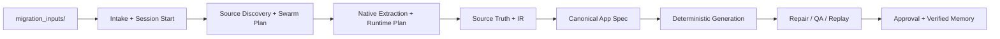

# NoCode2ProCode by TrustEngines Architecture

Genesis is a Claude Code-native framework. It uses YAML flow files for deterministic orchestration, Claude Code skills and subagents for expert work, MCP Gateway for external tools, E2B for sandbox verification, and Evidence Graph for traceability.

The current runtime architecture is:

- input-first intake through `migration_inputs/`
- durable runtime sessions with `runtime_session.json`
- stage-by-stage checkpoints in `checkpoint_manifest.json`
- swarm-style agent execution planning from `.genesis/genesis.agents.yaml`
- browser/runtime capture planning for Playwright or Firecrawl style providers
- provider/model routing plans per stage
- verified memory retrieval before planning and verified memory writeback after learning

The canonical flow is:

Input → native extraction → runtime evidence → source truth resolver → ULC-IR → canonical app spec → deterministic generators → Claude repair loop → QA/security/visual gates → replay dashboard → deployment → evidence-backed approval.

The current runtime entrypoint is a single migration command that reads from `migration_inputs/` and executes the flow through the Python orchestrator plus the Claude command surface.

